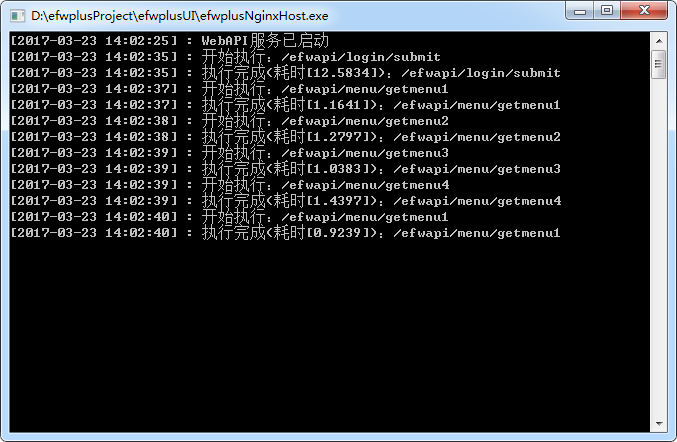
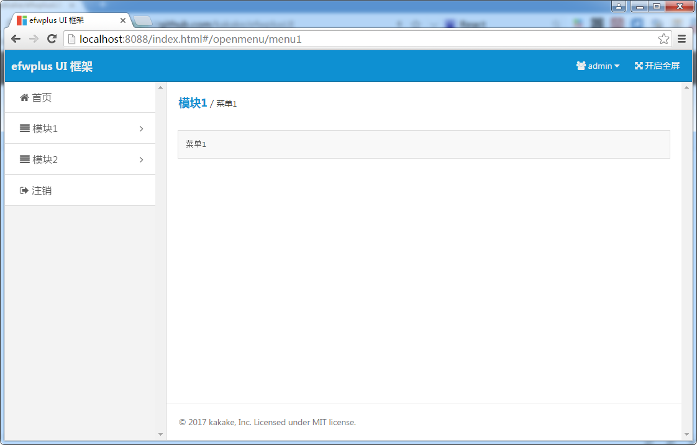
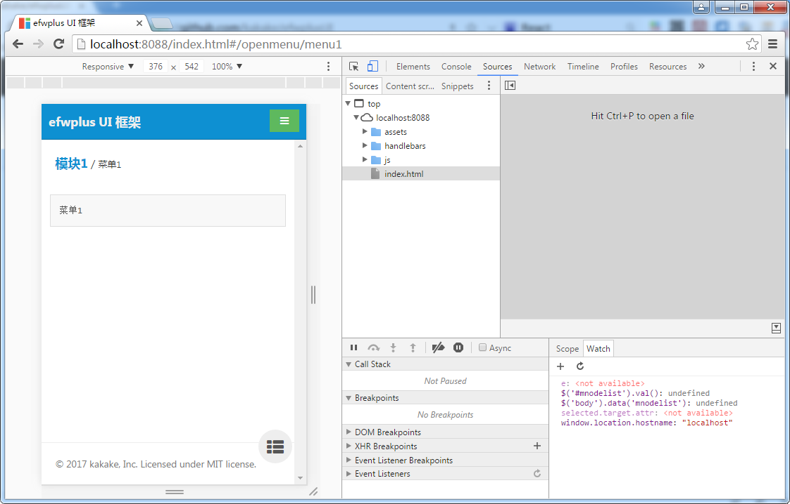
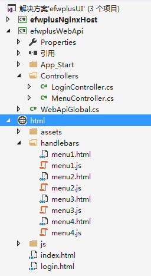

# efwplusUI
这是一个简单Web框架，前台采用amaze UI +requireJS+handlebarsJS，后台采用WebApi+MongoDB，用Nginx做Http服务器，随着.Net Core的跨平台，所以此框架也是可以在Liunx下运行。

为了保持WebApi接口访问安全，每次请求都增加了Token验证。

> 为什么用amaze UI 而没有用bootstrap，主要还是考虑到移动端amaze UI效果更好点，但amaze UI很多地方都不是很好用，特别是哪些扩展插件。

> 为什么用requireJS+handlebarsJS 来解决前台代码模块化，而没有用Vue.JS、angularjs、React，还是由于自己对Jquery熟悉一点、对Jquery相关插件熟悉一点，不想浪费而已。

> 用了这么多UI框架，个人觉得最好用的还是JqueryEasyUI，用起来真的相当省心省时。

* 下载程序安装包

[efwplusUI.rar](Docs/efwplusUI.rar)

[MongoDB](https://www.mongodb.com/download-center)


* 启动efwplusNginxHost.exe



* PC端效果



* 手机端效果



* 代码工程结构



* 相关配置

```xml
<configuration>
  <appSettings>
    <add key="WebApiUri" value="http://localhost:8021"></add>
    <add key="mongodb_binpath" value="C:\MongoDB\Server\3.2\bin"/>
    <add key="mongodb_conn" value="mongodb://localhost:27017"/>
  </appSettings>
</configuration>
```

## 快速开始

* MenuController.cs 
> 编写后台WebApi控制器代码，向前台提供接口数据

```c#
public class MenuController : ApiController
{
	[HttpGet]
	public object getmenu1()
	{
		return "菜单1";
	}

	[HttpGet]
	public object getmenu2()
	{
		return "菜单2";
	}

	[HttpGet]
	public object getmenu3()
	{
		return "菜单3";
	}

	[HttpGet]
	public object getmenu4()
	{
		return "菜单4";
	}
}
```

* menu1.html 
> 编写前台展示Html页面，主界面是通过require.js动态装载此页面

```html
<script id="menu1-template" type="text/x-handlebars-template">
    <div class="am-u-sm-12 am-u-sm-centered">
        <pre>{{data}}</pre>
    </div>
</script>
```

* menu1.js 
> 编写前台页面对应的JS脚本代码，是采用AMD规范封装为一个模块

```js
define(['jquery', 'common', "handlebars.min", "text!../../handlebars/menu1.html"], function ($, common, Handlebars, html_template) {

    //通用
    function show_common(menuId, para, urls, templates, callback, errorcallback) {
        if (!urls[menuId] || !templates[menuId]) {
            $('#content_body').html(html_template);//加载html模板文本
            //设置多个url和模板
            urls[menuId] =  para;

            templates[menuId] = Handlebars.compile($("#" + menuId + "-template").html());
        }

        common.simpleAjax(urls[menuId], {}, function (data) {
            var context = { data: common.toJson(data) };
            var html = templates[menuId](context);
            $('#content_body').html(html);

            if (callback) {
                callback(data);
            }
        }, errorcallback);
    }

    //
    function show_page(menuId, urls, templates) {
        show_common(menuId, "menu/getmenu1", urls, templates);
    }

    return {
        showpage: show_page
    };
});
```